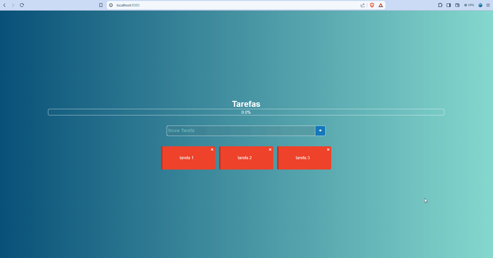
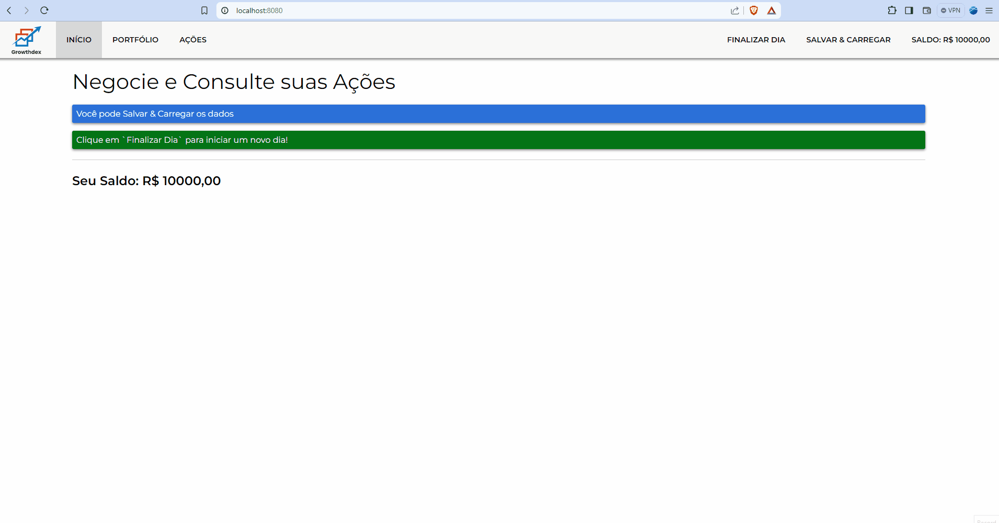
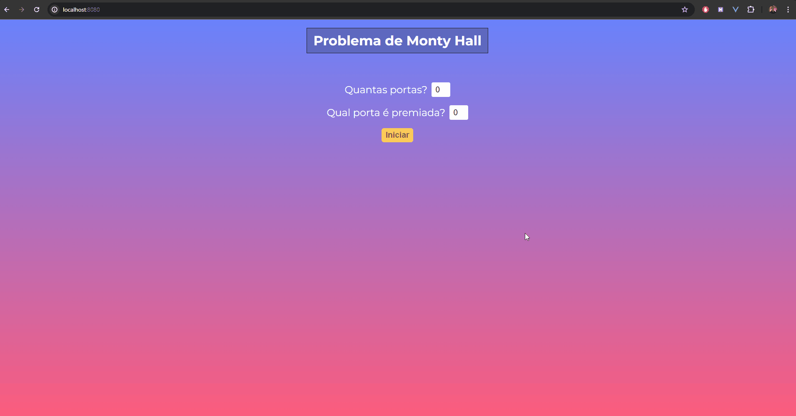

# Vue-JS-2

    
    
    
    
    

  
This repository contains the code I developed while learning the Vue.js framework through the Udemy/Cod3r course "Vue JS 2 - O Guia Completo" instructed by Leonardo Leitão. The course was inspired by Maximilian Schwarzmüller's Vue 2 course. Some of the topics covered include:

- **DOM manipulation** by Vue (event binding, interpolation, reactive properties, conditional rendering, list rendering, etc);
- **Vue instance** (name, components, props, computed properties, data, watches, methods, lifecycles, etc);
- **Vue CLI** (Command Line Interface);
- Vue **components and communication** between them (props, event emission, event bus);
- Vue **directives, filters, mixins, transitions and animations**;
- Integration with HTTP requests via **axios**;
- **Vue-router** for managing application routes;
- **Vuex** for managing, centralizing, and sharing data between application components;
- 5 coding projects of varying difficulty throughout the course.

I would also like to state that all the projects below were fully developed using my own knowledge and research (through documentation and online resources) before I watched the instructor's solution. Check out some of the projects I developed during the course:

## Project 01 - The Monster Killer
The player has three moves to defeat the monster, with damage and healing values being randomly generated:

**Attack**: The player and monster attack each other. Usually, the monster deals more damage than the player.  
**Special Attack**: The player and monster attack each other. Usually, the player deals more damage than the monster.  
**Heal**: The player heals themselves while the monster attacks. Usually, the player heals more than the monster's damage.

In this project, Vue was directly integrated on the HTML file.

## Project 02 - Task List
A task list with a progress bar that uses local storage to mantain data.

## Project 03 - The Stock Trader
The user can buy and sell stocks to increase their money. When the user clicks on "Finalizar Dia," the (buy and sell) values are randomly adjusted, and the price of each stock can go up or down. The user can also save and load their progress (money and current stocks) by clicking on "Salvar Dados" and "Carregar Dados," respectively.

**Vuex** was used to manage and share data between components.  
**Vue-router** was used to manage the SPA routes.  
**axios** was used to handle HTTP connections (sending and retrieving data from the database).  
**Firebase** was used to store the project data.

### Project 04 - Calculator
Project 04 was just a standard calculator, so I will skip detailing it here, though I did code it as well (specifically for this project, I watched the video first and followed the instructor's solution).

## Project 05 - Monty Hall Problem
In the Monty Hall problem, a person must try to guess which door hides a gift. After choosing a door, the game master opens all other doors that do not contain the gift, leaving only two doors remaining (the chosen one and one other). The person then has the option to switch their choice or stick with their initial one.

While it may seem that there's no difference with only three doors (as it might appear to be pure luck), this is not true. Because the game master eliminates incorrect options, the person should always switch doors, as the chance of finding the gift is higher.

*(For example, with 10 doors, the person has a 10% chance of picking the correct door on the first guess, but when 8 wrong options are eliminated, the chance that the gift is behind the other remaining door is much higher than the initial 10% chance.)*

